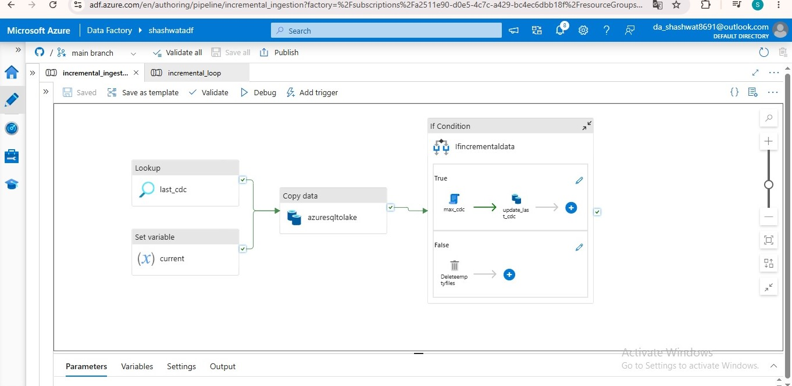
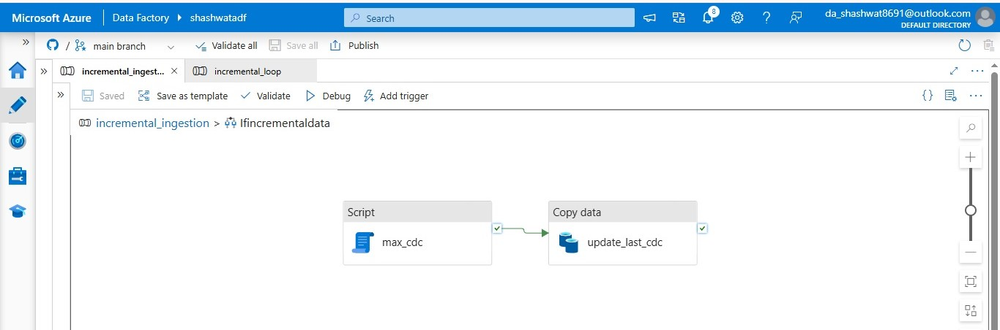
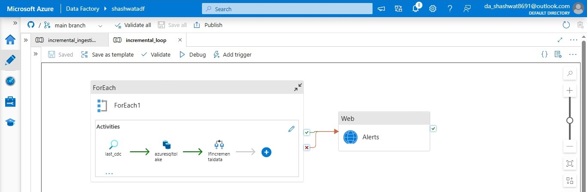
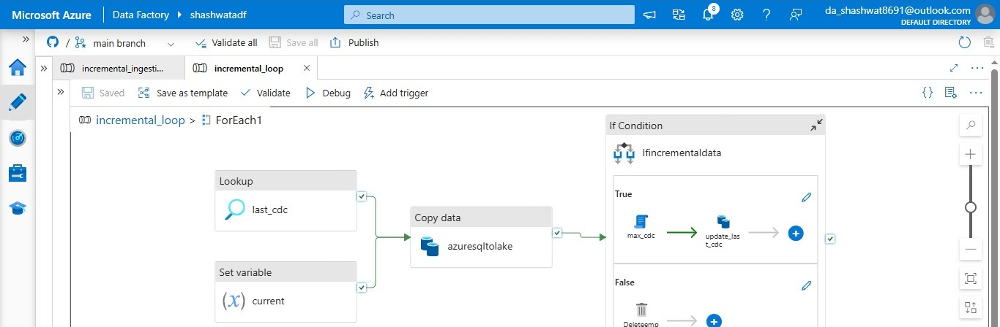

# 🎧 Spotify End-to-End Azure Data Engineering Project

An end-to-end data engineering portfolio project built with Microsoft Azure and Databricks. It demonstrates incremental ingestion, orchestration, lakehouse processing, and analytical data modelling using a Medallion Architecture.

**GitHub repository:** https://github.com/srivshashwat8/Azure-Data-Engineering-Project-Spotify-End-To-End

## Project Overview

The goal of this project is to build a repeatable data pipeline for Spotify-related data, moving data from the source into a data lake and preparing it for analytics.

The solution combines Azure Data Factory (ADF) for ingestion and orchestration with Azure Data Lake Storage Gen2 (ADLS Gen2) and Azure Databricks for data processing. The lakehouse follows the Bronze → Silver → Gold pattern.

## Architecture at a Glance

```text
Source data (Azure SQL Database)
              |
              v
     Azure Data Factory
  Lookup watermark / metadata
              |
       Incremental Copy
              |
              v
      ADLS Gen2 — Bronze
              |
              v
 Azure Databricks / Auto Loader
       PySpark transformations
              |
              v
       ADLS / Delta — Silver
              |
              v
     Gold / dimensional model
       (facts and dimensions)
              |
              v
       Analytics / reporting
```

> The exact downstream consumers depend on the resources enabled in your Azure environment. The screenshots in this repository document the ADF ingestion and orchestration workflows.

## Technology Stack

- **Azure Data Factory** — pipeline orchestration, Lookup, Copy Data, ForEach, If Condition, variables, and Web activity.
- **Azure Data Lake Storage Gen2** — cloud storage for the data lake.
- **Azure Databricks** — distributed processing with Spark and PySpark.
- **Auto Loader / Structured Streaming** — incremental discovery and ingestion of new files from cloud storage.
- **Delta Lake** — reliable table storage for transformed data.
- **Unity Catalog** — data governance and access management for supported Databricks resources.
- **GitHub** — source control and project documentation.

## Key Features

### 1. Incremental ingestion

The ADF workflow reads the previous CDC/watermark value, extracts new or changed data, and updates the stored watermark after successful processing. This avoids reloading the entire source on every run.

A robust watermark design should:
- Read the last successfully processed watermark from persistent storage.
- Capture a fixed upper watermark for the current run where applicable.
- Extract records within the intended watermark range.
- Update the persisted watermark only after the data load succeeds.
- Make reruns safe to avoid duplicate data.

### 2. Dynamic, loop-based orchestration

The loop pipeline uses a **ForEach** activity to execute the ingestion workflow for each configured item. This pattern can be extended to process multiple tables or entities without manually creating a separate pipeline for every source.

### 3. Conditional processing

An **If Condition** checks whether incremental data is available. The true branch runs the CDC/watermark update steps; the false branch handles the no-data path, including temporary-file cleanup as configured.

### 4. Failure alerts

The loop workflow routes execution outcomes to a Web activity named `Alerts`. This can be connected to a webhook or alerting endpoint so that failures are surfaced instead of going unnoticed.

### 5. Lakehouse transformation

Databricks can incrementally ingest files from Bronze, apply PySpark cleansing and standardisation, and write curated Delta tables to Silver and Gold layers. The Medallion approach separates raw data from cleaned data and business-ready datasets.

## Azure Data Factory Pipeline Screenshots

### 1. Incremental ingestion pipeline

The parent pipeline coordinates the watermark lookup, variable assignment, copy activity, and conditional CDC handling.



### 2. Conditional CDC handling

The `If Condition` contains the true branch for CDC/watermark handling and the false branch for the no-data path.



### 3. Loop pipeline and alerts

The loop pipeline runs the ingestion activities inside `ForEach` and routes success/failure outcomes to a Web activity for alerts.



### 4. ForEach workflow

The expanded loop shows the per-item sequence: watermark lookup, copy to the lake, and conditional processing.



## Repository Contents

The repository contains the project implementation and supporting assets. The screenshots above are provided in `docs/images/` for quick reference and documentation.

```text
.
├── README.md
└── docs/
    └── images/
        ├── adf-incremental-ingestion-overview.jpg
        ├── adf-incremental-condition.jpg
        ├── adf-loop-and-alerts.jpg
        └── adf-foreach-workflow.jpg
```

When merging this README into the existing project repository, keep your existing source folders and files; add the `docs/images/` folder alongside them.

## How to Explore the Project

1. Review the ADF pipeline JSON and linked-service/dataset definitions in the repository.
2. In Azure Data Factory, inspect the Lookup activity that reads the last CDC/watermark value.
3. Follow the Copy Data activity to see how source data is written to ADLS Gen2.
4. Inspect the `If Condition` and the watermark update activity.
5. Review the `ForEach` pipeline and its alerting path.
6. In Databricks, review the notebooks and transformations for the Bronze, Silver, and Gold layers.
7. Validate that the watermark is advanced only after a successful load and that reruns do not duplicate data.

> **Cloud access note:** Running the project requires appropriately configured Azure resources, permissions, linked services, and credentials. Azure resources may incur charges. Do not commit access keys, client secrets, tokens, connection strings, or other credentials to GitHub.

## Engineering Concepts Demonstrated

- Incremental data loading and watermarking
- Pipeline orchestration and dependency handling
- Parameterised and loop-based ingestion patterns
- Conditional execution and no-data handling
- Failure notification through a Web activity
- ADLS Gen2 data-lake organisation
- Bronze, Silver, and Gold processing
- PySpark and Delta Lake concepts
- Git-based project versioning

## Author

**Shashwat Krishna**

- GitHub: [@srivshashwat8](https://github.com/srivshashwat8)
- Project: [Azure Data Engineering Project — Spotify End-to-End](https://github.com/srivshashwat8/Azure-Data-Engineering-Project-Spotify-End-To-End)
